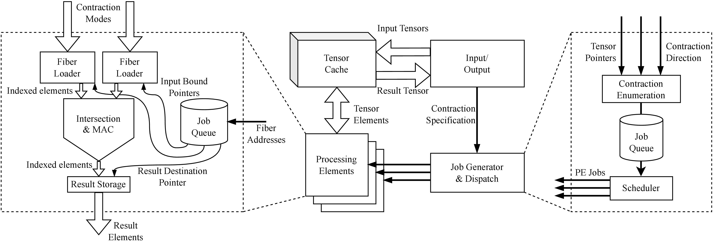

# CROSS-mini

A mini proof-of-concept high-dimensional sparse tensor contraction accelerator in SystemC.

## Building

Just run `make` for the default target (`tb_control`). Requires `g++` and the `systemc` library for the hardware portion. Versions tested:

- `systemc` 2.3.2-2
- `g++` 12.2.1
- `make` 4.4 

## Running

Manually invoke `./tb_control` after you run `make`.
Test inputs will be read from `test_inputs`.
The simulation will log lots of messages to the screen.

The driver and baseline comparison software need `scipy` running on Linux (should be distro-agnostic). Versions tested:

- `python` 3.10.9
- `scipy` 1.10.1-1
