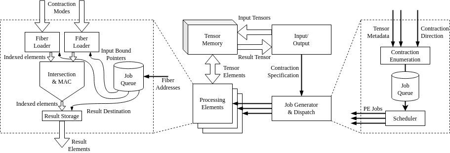

# CROSS-mini

A mini proof-of-concept high-dimensional sparse tensor contraction accelerator in SystemC.

## Building

Just run `make` for the default target (`tb_control`). Requires `g++` and the `systemc` library.

## Running

Manually invoke `./tb_control` after you run `make`.
Test inputs will be read from `test_inputs`.
The simulation will log lots of messages to the screen.
