### Accelerator Architecture   for Sparse High-Order   Tensor Contraction

Gabriel Kulp, Andrew Ensinger  
February 28, 2023

::: notes

Thank professor Chen, read title of talk

Feel free to interrupt with questions, but I might tell you to save it for the end.
Depends on the question.

:::

# Introduction

---

***FLAASH: Flexible Accelerator Architecture  
for Sparse High-Order Tensor Contraction***  
*Gabriel Kulp, Andrew Ensinger, Lizhong Chen*  
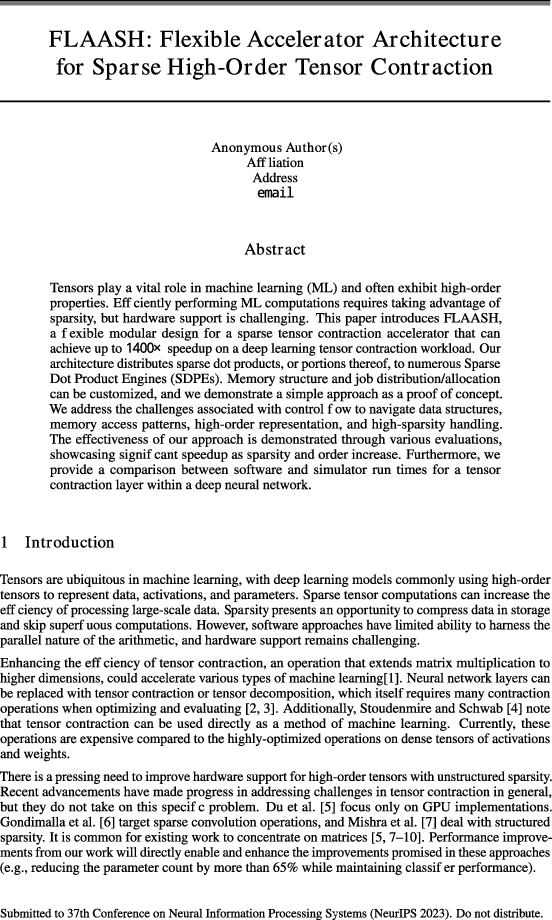{ width=200px }  
Paper submitted to ICML this month 

## Roadmap

1. **Introduction** *(you are here)*
2. **Background and Motivation**
	- What is sparse tensor contraction?
	- What are accelerators?
3. **Methods and Results**
	- What did we do?
	- Did it work?
4. **Future Work**
	- Where can we collaborate?

## Summary

- We designed an architecture in simulation
- It contracts sparse high-order tensors
- We also implemented it in Verilog
- The benchmark does well (~25x)

# Background

## Things I want to teach you

- What kind of math is this?
- Why would anyone want that?
- What have others done before us?

## What is a tensor?

- Multi-dimensional array
- Represents a multilinear transform
- Many applications

::: notes

Container

:::

---

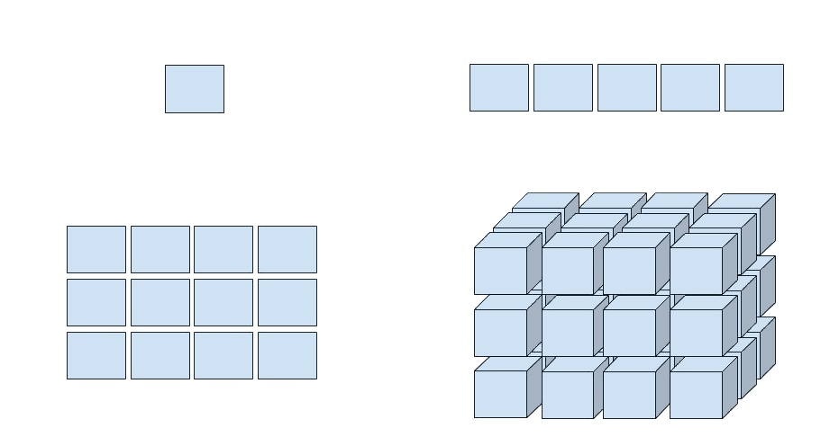

---

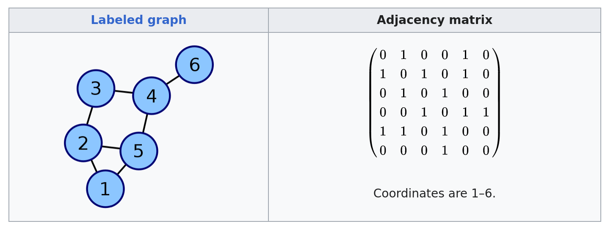

::: notes

It's symmetric, doesn't need to be.

:::

---

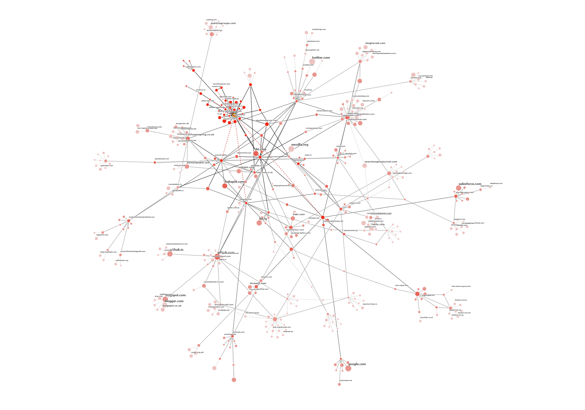

---

## Vocab

- **Mode**: single dimension/direction
- **Order**: how many modes
- **Fiber**: row, column, etc.
- **Coordinate**: which row and column?
- **Volume**: product of mode lengths

## High-Order? Sparse?

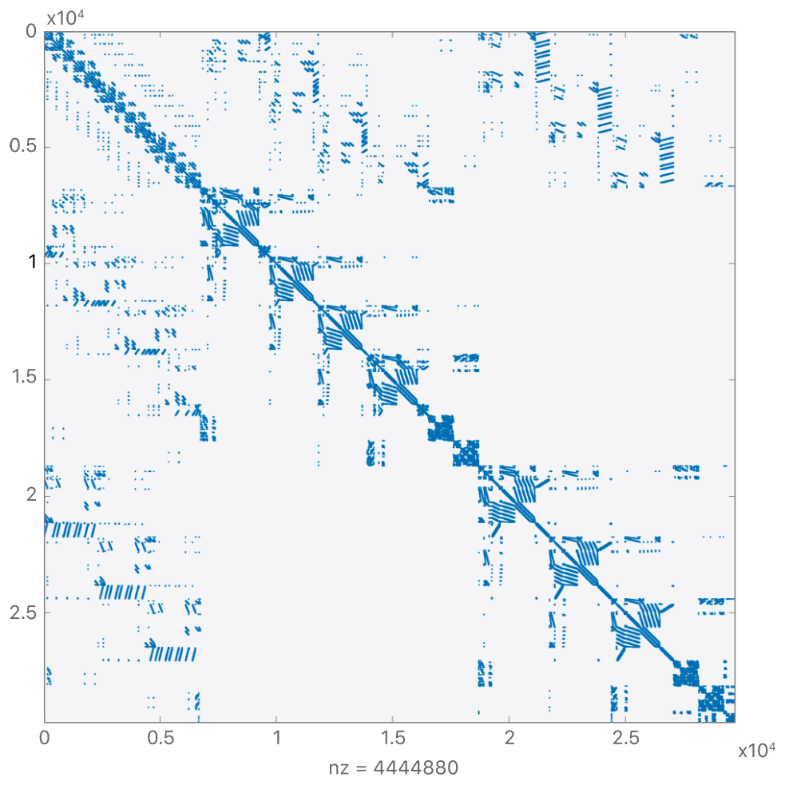{ class="r-stretch" }

"High-order" ≈ more than 3 modes

::: notes

- 3k by 3k, 0.5% dense.
- How would you write it?
- "Sparsity presents an opportunity"
- Gravity, label heights first
- Coordinate list

:::

## Tensor contraction

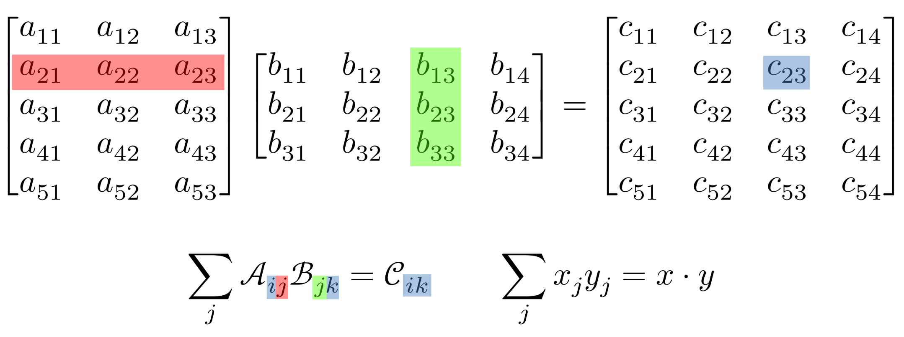

- Matrix multiplication but general
- Choose one direction each, then dot everything

::: notes

- Tensor dot, tensor product, Einsum
- Parallel, dots happen simultaneously

:::

## What is an accelerator?

- CPUs are general
- GPUs are more specific
- GPUs are accelerators
- Accelerators do something specific

::: notes

GPUs good at neural networks, too: similar workload

:::

---

1. CPU gives the problem to the accelerator
2. Accelerator solves it
3. Results sent back to CPU

## Challenges

1. Control flow
2. Memory access
3. Workload balance

::: notes

- Control: jumping to different parts of algorithm.
	- CPUs good, not parallel. GPUs bad but parallel
- Memory: "The way that computers deal with caching previous values for reuse later is messed up by the compression methods that we can use on sparse tensors"
	- Depends on compression format, might look random

:::

# Methods

## Overview

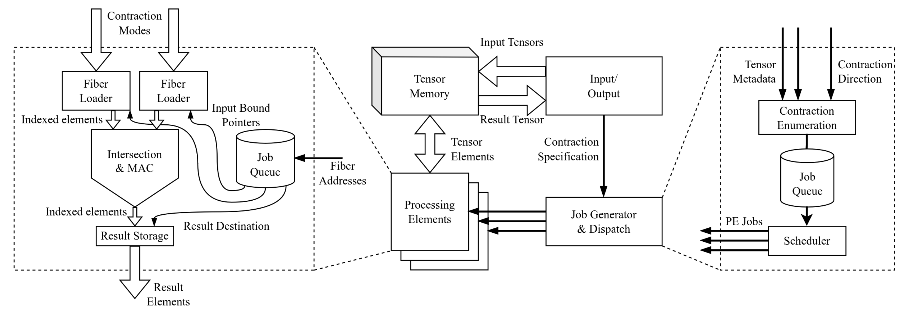

::: notes

- Fancy picture to impress ICML reviewers
- Don't be scared, focus on the middle
- Our arch, our implementation

:::

---

### Four parts

1. Tensor Memory
2. Job Generation and Dispatch
3. Processing Elements ("workers")
4. Input/Output Interface

## Tensor Memory

- Convert coordinates to pointers
- Manage data structures
	- Bookkeeping
	- Dynamic maintenance
- Manage caching

## Job Generation and Dispatch

- List all dot products (on-demand)
- Queue them up
- Send to workers
- Wait until queue is empty and workers are done

## Sparse Dot Product Engines

::: columns

:::: column
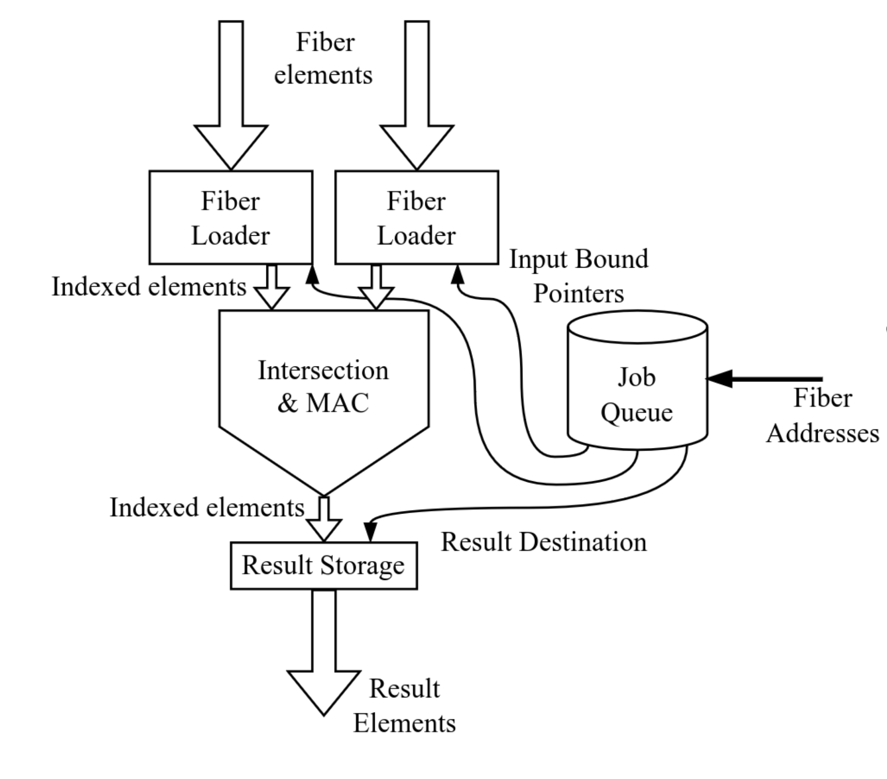{ width=400px }
::::

:::: column
Five parts:

1. Left fiber loader
2. Right fiber loader
3. Intersection and MAC
4. Storage queue
5. Job queue

::::

:::

::: notes

- *Focus on structure here, functional is next*
- Load fibers from each operand
- Intersection and MAC performs dot product
	- Will explain in a moment

:::

## Worker function

- Fetch fibers from operands
- "Zip" together the fibers
- Seek "intersections" where index matches
- Multiply and accumulate
- Send result to memory when done

## Input/Output Interface

- Handle allocation and transfer of tensors
- Provide connection to physical memory
	- Queuing and batching for DRAM
	- Or DMA to the host

---

::: notes

Order: mem, job, PE, IO

And all this fits in less than half a square millimeter

:::

# Results

## How did I get results?

- Wrote accelerator in Verilog
- Simulate performance with Xilinx Vivado
- Compare simulated performance to software
- Baseline is PyTorch and Tensorflow

::: notes

- Used the best unstructured sparsity options available

:::

## How did it do?

- Linear time complexity as expected
- Believable speedup over existing tools
- Reasonable clock speed and area

::: notes

- Linear: "this is actually fantastic"

:::

---

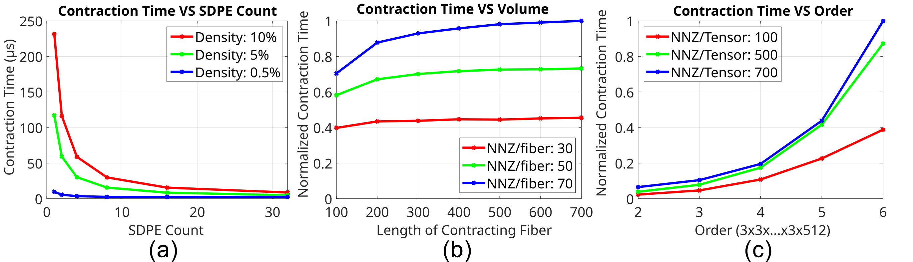

::: notes

5x5x1000, NNZ varies

:::

___

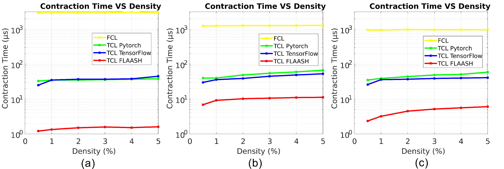

::: notes

- Order-3 has 5x5x1000 with 625 dot products
- Shape is nxn...nx1000, contract along 1000
- NNZ constant at 1000
- Order-6 result is order-10.
	- Takes 1024 dots for left point with size 2
	- Size 3 is 59000 dot products. Curse of dimensionality
- I want more point but they're slow, and this shows that it still works at high order

:::

___

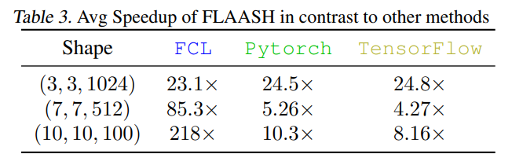

::: notes

Held something else constant: matrices (still tensors) are square, density is 1%

Error bars are standard deviation of 20 runs

:::

---

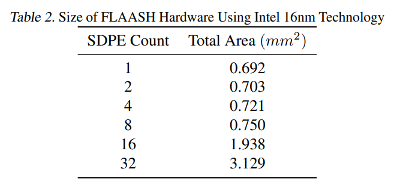

# Conclusion

## Future work

- Optimize jobs for cache residency
- Use a hash tree instead of CSF
- Integrate with `numpy` and/or `PyTorch`

## Thank You!

Questions?

::: notes

Thank you everyone for coming to listen to my defense!

Professor Chen, back to you. Or: I'll take questions from the public now.

:::

---

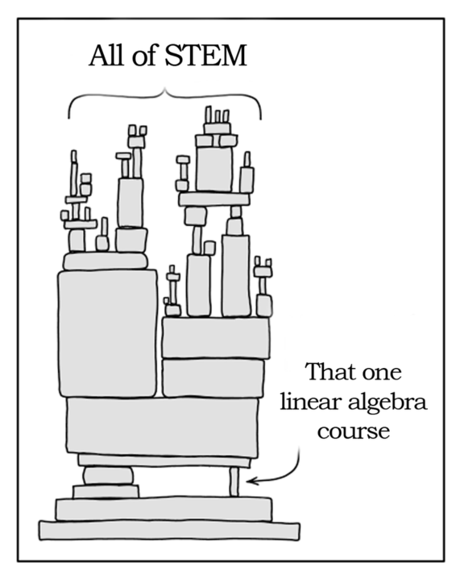{ class="r-stretch" }

---

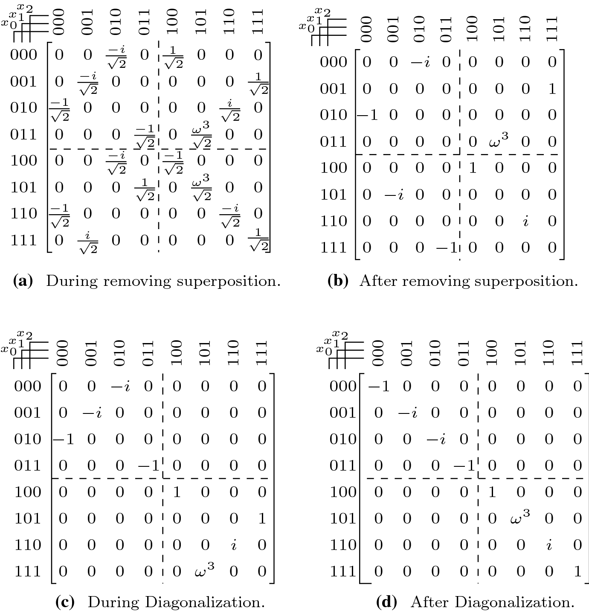{ width=500px }

---

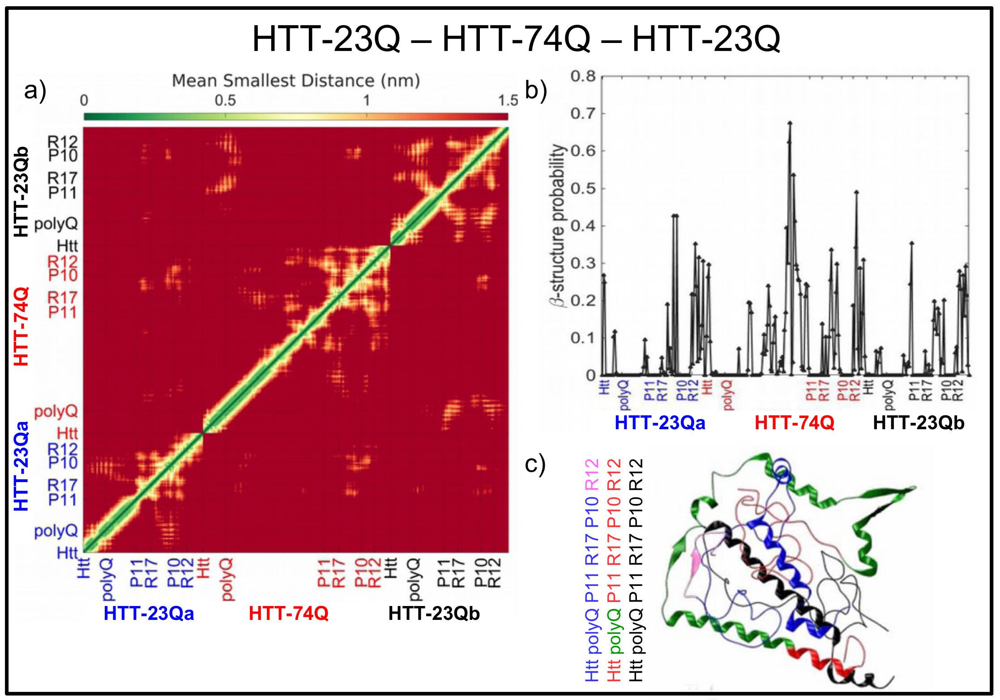

---

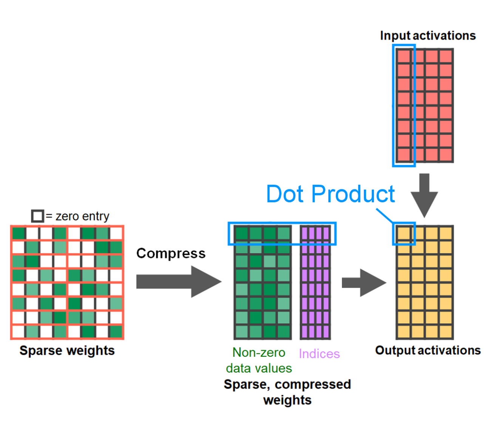{ width=450px }

---

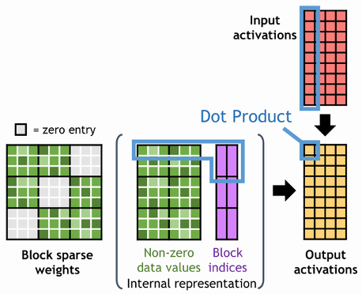

---

- Schartz Rehan, "The Shape of Tensor"
- Wikipedia "Adjacency Matrix"
- Majestic SEO "Link Graph"
- Apple Dev Documentation "Sparse Solvers"
- XKCD Comic 2347
- Philipp Niemann, et al. "Advanced exact synthesis of Clifford+T circuits"
- Silvia Bonfanti, et al. "Molecular mechanisms of heterogeneous oligomerization of huntingtin proteins"
- NVIDIA dev blog, "Accelerating Inference with Sparsity"

